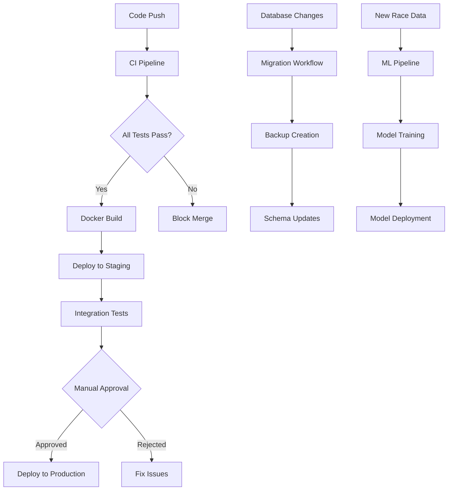

# CI/CD Pipeline Implementation

## Overview

This document describes the comprehensive CI/CD pipeline implemented for the F1 Prediction Analytics platform using GitHub Actions. The pipeline supports the multi-service architecture with automated testing, security scanning, deployment, and rollback capabilities.

## Architecture

The CI/CD implementation consists of 6 main workflows:

### 1. CI Pipeline (`ci.yml`)
**Trigger**: Pull requests and pushes to `develop`
**Purpose**: Continuous Integration with quality gates

#### Features:
- **Backend Tests**: Python unit tests with pytest, code coverage, linting with flake8/black
- **Frontend Tests**: React/TypeScript testing with Vitest, ESLint validation
- **Security Scanning**: Snyk and Trivy vulnerability scans
- **Integration Tests**: End-to-end API and database validation
- **Performance Tests**: Optional load testing with Locust
- **Quality Gates**: PR blocking based on test results and code quality

#### Services:
- PostgreSQL 15 test database
- Redis 7 for caching tests
- Automated test environment setup

### 2. Backend Deployment (`deploy-backend.yml`)
**Trigger**: Pushes to `main`, manual workflow dispatch
**Purpose**: Deploys Python API services with zero-downtime

#### Features:
- **Blue-Green Deployment**: Zero-downtime production updates
- **Canary Releases**: 10% traffic routing for safety validation
- **Database Migrations**: Automated Alembic migrations with backups
- **Health Checks**: Comprehensive service validation
- **Automatic Rollback**: On deployment failure detection
- **Safety Checks**: Business hours and weekend deployment restrictions

#### Environments:
- **Staging**: Automatic deployment for testing
- **Production**: Manual approval required, advanced safety checks

### 3. Frontend Deployment (`deploy-frontend.yml`)
**Trigger**: Frontend code changes, manual dispatch
**Purpose**: Deploys React applications to S3/CloudFront

#### Features:
- **Static Asset Optimization**: Gzip compression, cache headers
- **CDN Invalidation**: CloudFront cache management
- **Atomic Deployments**: Blue-green asset switching
- **Performance Auditing**: Lighthouse CI integration
- **Backup and Rollback**: Versioned asset management

#### Assets:
- Main React application (existing pasta recipes app)
- F1 Analytics React dashboard (new feature)

### 4. Database Migration (`database-migration.yml`)
**Trigger**: Database schema changes, manual execution
**Purpose**: Safe database schema evolution

#### Features:
- **Automated Backups**: Pre-migration RDS snapshots
- **Migration Validation**: Syntax checking and dry-run testing
- **Rollback Safety**: Emergency restoration procedures
- **Multi-Database Support**: Existing API database + F1 analytics database
- **Maintenance Windows**: Scheduled execution during low-traffic periods

#### Safety Measures:
- Business hours restrictions
- Automated backup verification
- Comprehensive rollback procedures

### 5. ML Model Deployment (`ml-model-deployment.yml`)
**Trigger**: Scheduled (weekly), manual trigger, new race data
**Purpose**: Trains and deploys F1 prediction models

#### Features:
- **Data Freshness Detection**: Automatic triggering on new race results
- **Feature Engineering**: ELO ratings, track performance, weather factors
- **Model Training**: Random Forest + XGBoost ensemble
- **Model Validation**: Staging environment testing before production
- **S3 Model Storage**: Versioned model artifacts with metadata
- **Performance Monitoring**: Prediction accuracy tracking

#### ML Pipeline:
1. Data ingestion from Ergast API and weather services
2. Feature engineering (ELO ratings, recent form, track history)
3. Model training (Random Forest + XGBoost)
4. Staging validation
5. Production deployment with graceful model reloading

### 6. Docker Build (`docker-build.yml`)
**Trigger**: Code changes, manual builds
**Purpose**: Containerizes all services for deployment

#### Features:
- **Multi-Service Builds**: API, F1 Analytics Backend, F1 Analytics Frontend
- **Security Scanning**: Trivy vulnerability analysis
- **Multi-Platform Images**: AMD64 and ARM64 support
- **Docker Compose**: Development and production configurations
- **SBOM Generation**: Software Bill of Materials for compliance

#### Images:
- `ghcr.io/repo-api`: Existing Flask/FastAPI service
- `ghcr.io/repo-f1-analytics-backend`: Python ML service
- `ghcr.io/repo-f1-analytics-frontend`: React SPA with Nginx

## Security Features

### Code Security
- **SAST Scanning**: Static analysis with CodeQL
- **Dependency Scanning**: Snyk and Dependabot vulnerability detection
- **Secret Management**: GitHub Secrets for sensitive data
- **Container Scanning**: Trivy image vulnerability analysis

### Deployment Security
- **Least Privilege**: Minimal IAM permissions
- **Environment Isolation**: Separate staging/production credentials
- **Network Security**: VPC isolation, security groups
- **Audit Logging**: All deployment activities logged

### Compliance
- **SBOM Generation**: Software Bill of Materials
- **Vulnerability Reports**: SARIF format for security dashboards
- **Access Controls**: Required reviews for production deployments

## Monitoring and Observability

### Deployment Tracking
- **GitHub Deployments**: Status tracking for each environment
- **Commit Comments**: Automated deployment status updates
- **Release Notes**: Automated generation from commit history

### External Integrations
- **DataDog**: Deployment events and metrics
- **Slack/PagerDuty**: Alert routing for failures
- **Lighthouse CI**: Performance monitoring

### Health Checks
- **Application Health**: HTTP endpoints for service validation
- **Database Health**: Connection and query validation
- **Cache Health**: Redis connectivity checks

## Environment Configuration

### Required Secrets
```
# AWS Infrastructure
AWS_ACCESS_KEY_ID
AWS_SECRET_ACCESS_KEY
AWS_REGION

# Database
STAGING_DATABASE_URL
PRODUCTION_DATABASE_URL
STAGING_F1_DATABASE_URL
PRODUCTION_F1_DATABASE_URL

# Caching
STAGING_REDIS_URL
PRODUCTION_REDIS_URL

# Frontend Deployment
STAGING_S3_BUCKET
PRODUCTION_S3_BUCKET
STAGING_CLOUDFRONT_DISTRIBUTION_ID
PRODUCTION_CLOUDFRONT_DISTRIBUTION_ID

# Authentication
JWT_SECRET_KEY
ADMIN_JWT_TOKEN

# External APIs
ERGAST_API_KEY
WEATHER_API_KEY

# Monitoring
DATADOG_API_KEY
SNYK_TOKEN
```

### Environment Variables
- **ENVIRONMENT**: `development|staging|production`
- **API URLs**: Service endpoint configuration
- **Feature Flags**: Toggle functionality per environment

## Workflow Dependencies



## Best Practices Implemented

### Deployment Safety
- **Blue-Green Deployments**: Zero-downtime updates
- **Canary Releases**: Gradual traffic routing
- **Automated Rollback**: Failure detection and recovery
- **Health Checks**: Comprehensive service validation

### Testing Strategy
- **Unit Tests**: Component-level validation
- **Integration Tests**: Service interaction validation
- **End-to-End Tests**: User workflow validation
- **Performance Tests**: Load and latency validation

### Code Quality
- **Linting**: Automated style enforcement
- **Type Checking**: TypeScript and mypy validation
- **Security Scanning**: Vulnerability detection
- **Coverage Reporting**: Test coverage tracking

## Rollback Procedures

### Automated Rollback Triggers
- **Health Check Failures**: >50% pods failing for 5 minutes
- **Error Rate Spike**: >10% error rate for 3 minutes
- **Performance Degradation**: p95 latency >2s for 5 minutes

### Manual Rollback Commands
```bash
# Kubernetes rollback
kubectl rollout undo deployment/api-service -n production

# Database rollback
alembic downgrade -1

# Model rollback
aws s3 cp s3://bucket/backup/model.pkl s3://bucket/production/
```

## Performance Optimizations

### Build Optimization
- **Docker Layer Caching**: GitHub Actions cache
- **Dependency Caching**: NPM and pip package caching
- **Parallel Builds**: Multi-service concurrent building

### Deployment Optimization
- **Asset Optimization**: Compression and CDN caching
- **Database Connections**: Connection pooling
- **Model Caching**: Redis-backed prediction caching

## Troubleshooting

### Common Issues
1. **Build Failures**: Check dependency versions and conflicts
2. **Test Failures**: Verify test database connectivity
3. **Deployment Failures**: Check environment variables and permissions
4. **Model Training Failures**: Verify data availability and S3 access

### Debug Commands
```bash
# Check workflow status
gh workflow list

# View workflow logs
gh run view <run-id> --log

# Check deployment status
kubectl get deployments -n production

# View service logs
kubectl logs deployment/api-service -n production
```

## Metrics and KPIs

### Deployment Metrics
- **Deployment Frequency**: Target: Multiple deployments per day
- **Lead Time**: Target: <30 minutes from commit to production
- **Mean Time to Recovery**: Target: <5 minutes
- **Change Failure Rate**: Target: <5%

### Quality Metrics
- **Test Coverage**: Target: >80%
- **Build Success Rate**: Target: >95%
- **Security Vulnerabilities**: Target: 0 high/critical

## Future Enhancements

### Planned Improvements
1. **GitOps Integration**: ArgoCD for Kubernetes deployments
2. **Progressive Delivery**: Advanced canary analysis
3. **Chaos Engineering**: Automated resilience testing
4. **Compliance Automation**: SOC2/GDPR validation
5. **Cost Optimization**: Resource usage monitoring

### ML Pipeline Enhancements
1. **A/B Testing**: Model performance comparison
2. **Feature Store**: Centralized feature management
3. **Model Drift Detection**: Automatic retraining triggers
4. **Explainable AI**: Prediction interpretation
5. **Real-time Inference**: Streaming prediction updates

This CI/CD implementation provides a robust, scalable foundation for the F1 Prediction Analytics platform with enterprise-grade security, monitoring, and operational capabilities.