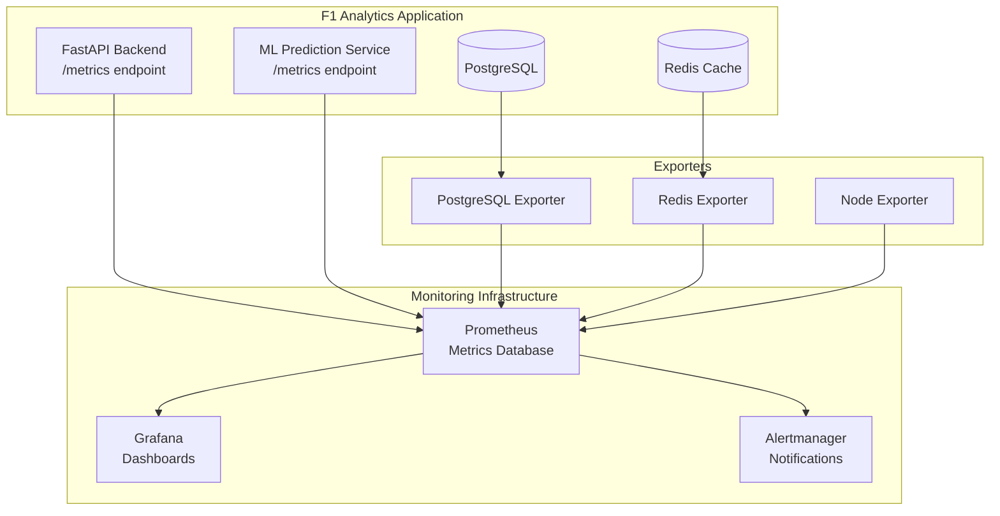

# F1 Analytics Monitoring and Observability Guide

This guide covers the comprehensive monitoring and observability implementation for the F1 Prediction Analytics platform, including Prometheus metrics collection, alerting, and operational best practices.

## Table of Contents

1. [Overview](#overview)
2. [Architecture](#architecture)
3. [Metrics Collection](#metrics-collection)
4. [Alert Rules](#alert-rules)
5. [Deployment](#deployment)
6. [Operations Guide](#operations-guide)
7. [Troubleshooting](#troubleshooting)
8. [Development Guide](#development-guide)

## Overview

The F1 Analytics platform implements comprehensive monitoring across three layers:

- **Application Layer**: Business metrics, API performance, ML pipeline monitoring
- **Infrastructure Layer**: System metrics, database performance, cache operations
- **Business Layer**: F1-specific metrics like prediction accuracy, ELO ratings, data freshness

### Key Features

✅ **30-day metrics retention** with 50GB storage limit
✅ **Custom F1 business metrics** for prediction accuracy and race data
✅ **Comprehensive alert rules** for application and infrastructure
✅ **Service discovery** for both Docker Compose and Kubernetes
✅ **Automatic instrumentation** of FastAPI endpoints
✅ **ML pipeline monitoring** with inference latency tracking

## Architecture

### Monitoring Stack Components



### Data Flow

1. **Application Metrics**: Generated by FastAPI middleware and custom tracking
2. **Infrastructure Metrics**: Collected by specialized exporters
3. **Storage**: Prometheus scrapes and stores all metrics
4. **Visualization**: Grafana queries Prometheus for dashboards
5. **Alerting**: Prometheus evaluates rules and sends to Alertmanager

## Metrics Collection

### Application Metrics

#### HTTP Metrics
```prometheus
# Total HTTP requests by method, endpoint, and status
http_requests_total{method="GET", endpoint="/api/v1/predictions/next-race", status="2xx"}

# HTTP request duration histogram
http_request_duration_seconds{method="GET", endpoint="/api/v1/predictions/next-race"}
```

#### F1 Business Metrics
```prometheus
# Prediction generation metrics
f1_predictions_generated_total{model_type="random_forest", race_type="grand_prix", success="success"}

# Model accuracy tracking
f1_prediction_accuracy{model_type="xgboost", race_type="sprint", timeframe="last_5_races"}

# ML pipeline performance
f1_ml_inference_duration_seconds{model_type="random_forest", stage="race_prediction"}

# Feature engineering timing
f1_feature_engineering_duration_seconds{feature_type="weather", data_source="openweather"}

# Driver ELO ratings
f1_driver_elo_rating{driver_name="Max Verstappen", driver_code="VER", team="Red Bull Racing"}

# Data freshness
f1_race_data_freshness_seconds{data_type="race_results"}

# Cache performance
f1_cache_operations_total{operation="get", cache_type="race_predictions", status="hit"}
```

### Infrastructure Metrics

#### Database Metrics (PostgreSQL Exporter)
```prometheus
# Connection pool usage
pg_stat_database_numbackends{datname="f1_analytics"}
pg_settings_max_connections

# Query performance
pg_stat_database_tup_returned{datname="f1_analytics"}
pg_stat_database_tup_fetched{datname="f1_analytics"}

# Custom F1 queries
f1_race_data_freshness  # Seconds since last race update
f1_prediction_count     # Predictions in last 24 hours
f1_accuracy_metrics     # Accuracy by model type
f1_database_size        # Table sizes
```

#### Cache Metrics (Redis Exporter)
```prometheus
# Memory usage
redis_memory_used_bytes
redis_memory_max_bytes

# Operations
redis_commands_total{cmd="get"}
redis_commands_total{cmd="set"}

# Connection metrics
redis_connected_clients
redis_rejected_connections_total
```

### Collection Configuration

#### Scrape Intervals
- **Application metrics**: 15 seconds
- **Infrastructure metrics**: 30 seconds
- **Business metrics**: 15 seconds (for real-time prediction tracking)

#### Retention Policy
- **Raw metrics**: 30 days
- **Downsampled (5m)**: 90 days
- **Downsampled (1h)**: 1 year

## Alert Rules

### Application Alerts

#### High Error Rate
```yaml
- alert: F1AnalyticsHighErrorRate
  expr: rate(http_requests_total{job="f1-analytics-api-gateway",status=~"5.."}[5m]) / rate(http_requests_total{job="f1-analytics-api-gateway"}[5m]) > 0.05
  for: 2m
  labels:
    severity: critical
    service: f1-analytics
  annotations:
    summary: "F1 Analytics API Gateway high error rate"
    description: "Error rate is {{ $value | humanizePercentage }} for the F1 Analytics API Gateway"
```

#### High Prediction Latency
```yaml
- alert: F1PredictionsHighLatency
  expr: histogram_quantile(0.95, rate(f1_ml_inference_duration_seconds_bucket{model_type=~".*"}[5m])) > 5
  for: 5m
  labels:
    severity: warning
    service: f1-analytics
  annotations:
    summary: "F1 prediction inference latency high"
    description: "95th percentile prediction inference latency is {{ $value }}s for model {{ $labels.model_type }}"
```

#### Data Staleness
```yaml
- alert: F1DataStale
  expr: f1_race_data_freshness_seconds{data_type="race_results"} > 86400
  for: 10m
  labels:
    severity: warning
    service: f1-analytics
  annotations:
    summary: "F1 race data is stale"
    description: "F1 {{ $labels.data_type }} data has not been updated for {{ $value | humanizeDuration }}"
```

#### Low Prediction Accuracy
```yaml
- alert: F1PredictionAccuracyLow
  expr: f1_prediction_accuracy{timeframe="last_5_races"} < 0.6
  for: 15m
  labels:
    severity: warning
    service: f1-analytics
  annotations:
    summary: "F1 prediction accuracy is low"
    description: "F1 prediction accuracy for {{ $labels.model_type }} is {{ $value | humanizePercentage }} over the last 5 races"
```

### Infrastructure Alerts

#### Database Connection Pool
```yaml
- alert: F1DatabaseConnectionPoolHigh
  expr: pg_stat_database_numbackends{datname="f1_analytics"} / pg_settings_max_connections > 0.8
  for: 5m
  labels:
    severity: warning
  annotations:
    summary: "F1 Analytics database connection pool usage high"
```

#### Redis Memory Usage
```yaml
- alert: F1RedisMemoryHigh
  expr: redis_memory_used_bytes{job="redis-f1-analytics"} / redis_memory_max_bytes > 0.9
  for: 5m
  labels:
    severity: warning
  annotations:
    summary: "F1 Analytics Redis memory usage high"
```

## Deployment

### Docker Compose Setup

#### Development Environment
```bash
# Start with basic monitoring
docker-compose -f f1-analytics/infrastructure/docker-compose.yml up -d

# Access metrics endpoint
curl http://localhost:8000/metrics
```

#### Production Environment
```bash
# Start with full monitoring stack
docker-compose -f f1-analytics/infrastructure/docker-compose.prod.yml up -d

# Verify Prometheus is scraping
open http://localhost:9090/targets

# Access Grafana dashboards
open http://localhost:3001
```

### Kubernetes Deployment

```bash
# Deploy monitoring infrastructure
kubectl apply -f infrastructure/monitoring/prometheus.yaml

# Verify monitoring pods
kubectl get pods -n f1-analytics -l component=monitoring

# Check metrics scraping
kubectl port-forward -n f1-analytics svc/prometheus-service 9090:9090
```

### Configuration Files

#### Prometheus Configuration
- **Docker**: `f1-analytics/infrastructure/monitoring/prometheus.yml`
- **Kubernetes**: `f1-analytics/infrastructure/monitoring/prometheus-config.yaml`

#### Environment Variables
```env
# Enable metrics collection
PROMETHEUS_METRICS_ENABLED=true
METRICS_PORT=8000
MODEL_METRICS_ENABLED=true

# Retention configuration
PROMETHEUS_RETENTION_TIME=30d
PROMETHEUS_RETENTION_SIZE=50GB
```

## Operations Guide

### Service Level Indicators (SLIs)

#### Availability SLI
- **Target**: 99.9% uptime
- **Measurement**: `sum(rate(http_requests_total{status!~"5.."}[5m])) / sum(rate(http_requests_total[5m]))`

#### Latency SLI
- **Target**: <500ms 95th percentile
- **Measurement**: `histogram_quantile(0.95, rate(http_request_duration_seconds_bucket[5m]))`

#### Prediction Accuracy SLI
- **Target**: >70% accuracy for primary models
- **Measurement**: `f1_prediction_accuracy{model_type="random_forest", timeframe="last_5_races"}`

#### Data Freshness SLI
- **Target**: <6 hours for race data
- **Measurement**: `f1_race_data_freshness_seconds{data_type="race_results"} / 3600`

### Daily Operations Checklist

1. **Check Dashboard Health**
   - Verify all services are green in Grafana
   - Check for any active alerts

2. **Review Key Metrics**
   - API response times and error rates
   - Prediction accuracy trends
   - Resource utilization (CPU, memory, database)

3. **Data Freshness Validation**
   - Confirm race data is up-to-date
   - Verify external API connectivity

4. **Performance Analysis**
   - Review slow queries and optimize if needed
   - Check cache hit rates and adjust TTL if necessary

### Incident Response

#### High Error Rate
1. Check application logs for error patterns
2. Verify database and Redis connectivity
3. Review recent deployments or configuration changes
4. Scale resources if needed

#### High Latency
1. Identify slow endpoints from metrics
2. Check database connection pool usage
3. Review ML model inference times
4. Consider caching frequently accessed data

#### Data Staleness
1. Check external API status (Ergast, Weather)
2. Verify background job execution
3. Review data pipeline logs
4. Manual data refresh if needed

## Troubleshooting

### Common Issues

#### Metrics Not Appearing in Prometheus

**Symptoms**: Empty or missing metrics in Prometheus UI

**Debugging Steps**:
```bash
# 1. Check if /metrics endpoint is accessible
curl http://localhost:8000/metrics

# 2. Verify Prometheus configuration
docker logs f1-analytics-prometheus

# 3. Check service discovery
curl http://localhost:9090/api/v1/targets
```

**Solutions**:
- Ensure metrics middleware is properly configured in FastAPI
- Verify Prometheus can reach the application endpoint
- Check firewall and network connectivity

#### High Memory Usage in Prometheus

**Symptoms**: Prometheus container consuming excessive memory

**Debugging Steps**:
```bash
# Check current memory usage
docker stats f1-analytics-prometheus

# Review retention settings
grep -i retention /path/to/prometheus.yml
```

**Solutions**:
- Reduce retention period if necessary
- Implement metric downsampling
- Increase container memory limits

#### Missing F1-Specific Metrics

**Symptoms**: Standard HTTP metrics present but no F1 business metrics

**Debugging Steps**:
```bash
# Check if F1 metrics are being generated
curl http://localhost:8000/metrics | grep f1_

# Verify application code usage
grep -r "track_prediction" app/
```

**Solutions**:
- Ensure F1 tracking functions are called in application code
- Verify monitoring module is properly imported
- Check for errors in application logs

### Performance Optimization

#### Reduce Metric Cardinality
```python
# Bad: Too many unique label values
f1_driver_elo_rating{driver_id="1", driver_name="Max Verstappen", ...}

# Good: Limited label values
f1_driver_elo_rating{driver_code="VER", team="Red Bull Racing"}
```

#### Optimize Scrape Intervals
```yaml
# High-frequency for critical metrics
scrape_interval: 15s  # API health, error rates

# Lower frequency for less critical metrics
scrape_interval: 60s  # Database size, connection counts
```

## Development Guide

### Adding New Metrics

#### 1. Define the Metric
```python
# In app/monitoring/metrics.py
new_f1_metric = Counter(
    'f1_new_feature_total',
    'Description of the new metric',
    ['label1', 'label2'],
    registry=metrics_registry
)
```

#### 2. Create Tracking Function
```python
# In app/monitoring/metrics.py
def track_new_feature(label1_value: str, label2_value: str) -> None:
    """Track new feature usage."""
    new_f1_metric.labels(
        label1=label1_value,
        label2=label2_value
    ).inc()
```

#### 3. Use in Application Code
```python
# In your service/route
from app.monitoring import track_new_feature

def my_new_feature():
    # Your business logic
    result = do_something()

    # Track the metric
    track_new_feature("value1", "value2")

    return result
```

#### 4. Add Alert Rule (if needed)
```yaml
# In prometheus-config.yaml
- alert: NewFeatureIssue
  expr: rate(f1_new_feature_total[5m]) > 10
  for: 2m
  labels:
    severity: warning
  annotations:
    summary: "New feature usage spike detected"
```

### Testing Metrics

#### Unit Tests
```python
# In tests/unit/test_monitoring.py
def test_new_feature_metric():
    initial_value = new_f1_metric._value._value
    track_new_feature("test1", "test2")
    assert new_f1_metric._value._value > initial_value
```

#### Integration Tests
```python
# Test metrics endpoint
def test_metrics_endpoint_includes_new_metric():
    response = client.get("/metrics")
    assert "f1_new_feature_total" in response.text
```

### Best Practices

#### Metric Naming
- Use descriptive names: `f1_prediction_accuracy` not `accuracy`
- Follow Prometheus conventions: `_total` for counters, `_seconds` for durations
- Include service prefix: `f1_` for F1 Analytics metrics

#### Label Design
- Keep cardinality low (< 100 unique values per label)
- Use meaningful labels: `model_type` not `type`
- Avoid high-cardinality labels: user IDs, request IDs

#### Performance Considerations
- Use histograms for duration tracking
- Implement sampling for very high-frequency metrics
- Use context managers for automatic timing

## Conclusion

This monitoring implementation provides comprehensive observability for the F1 Analytics platform, covering both technical infrastructure and business-specific metrics. The system is designed to scale with the application and provide actionable insights for both development and operations teams.

For questions or improvements to this monitoring setup, please refer to the team documentation or create an issue in the project repository.