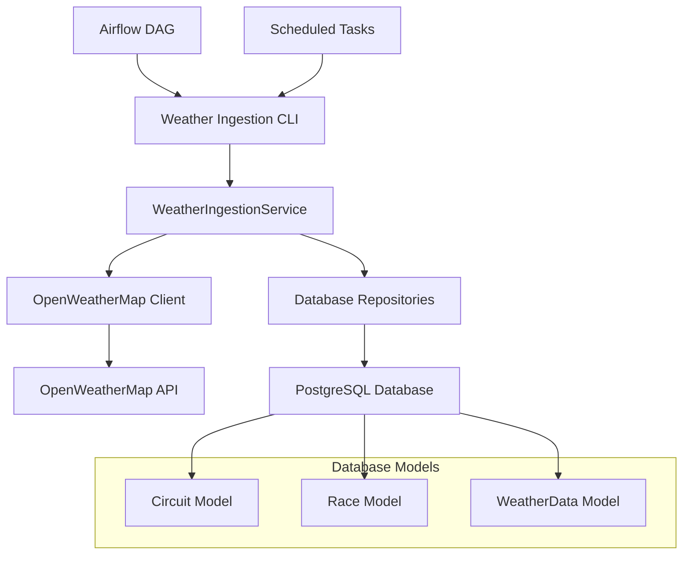

# Weather Data Ingestion Documentation

This document describes the weather data ingestion system for F1 prediction analytics, including geospatial matching capabilities and real-time weather data integration.

## Table of Contents

- [Overview](#overview)
- [Architecture](#architecture)
- [Components](#components)
- [Geospatial Matching](#geospatial-matching)
- [Usage](#usage)
- [API Reference](#api-reference)
- [Configuration](#configuration)
- [Testing](#testing)
- [Troubleshooting](#troubleshooting)

## Overview

The weather data ingestion system provides automated collection and processing of weather data for Formula 1 races using the OpenWeatherMap API. It includes:

- **Geospatial Matching**: Automatically matches race circuits to weather stations based on coordinates
- **Historical Backfilling**: Retrieves historical weather data for completed races
- **Current Weather Updates**: Fetches current and forecast weather for upcoming races
- **Data Validation**: Ensures data quality and consistency
- **Error Handling**: Robust error handling with logging and retry mechanisms

### Key Features

- ✅ Geospatial coordinate matching using Haversine distance formula
- ✅ Support for historical, current, and forecast weather data
- ✅ Automatic weather condition classification (DRY, WET, MIXED)
- ✅ Rate limiting and API quota management
- ✅ Comprehensive logging and monitoring
- ✅ Database transaction safety with rollback capabilities
- ✅ CLI tools for manual operations and debugging

## Architecture



## Components

### 1. OpenWeatherMap Client (`weather_client.py`)

HTTP client for interacting with the OpenWeatherMap API.

**Features:**
- Async/await support for non-blocking operations
- Current weather, historical weather, and forecast endpoints
- Automatic unit conversions (temperature, wind speed, precipitation)
- Weather condition mapping to F1 analytics categories
- Error handling for API failures and rate limiting

**Example Usage:**
```python
from data_ingestion.clients.weather_client import create_weather_client

client = create_weather_client()

# Get current weather
weather = await client.get_current_weather(
    latitude=43.7347,  # Monaco coordinates
    longitude=7.4202
)

# Get historical weather
historical = await client.get_historical_weather(
    latitude=43.7347,
    longitude=7.4202,
    timestamp=datetime(2024, 5, 26, 14, 0, tzinfo=timezone.utc)
)
```

### 2. Weather Ingestion Service (`weather_service.py`)

Core service that orchestrates the weather data ingestion process.

**Features:**
- Geospatial matching between circuits and weather stations
- Database operations for creating and updating weather records
- Batch processing with configurable limits
- Historical backfilling with progress tracking
- Upcoming race weather updates
- Circuit coordinate validation

**Example Usage:**
```python
from data_ingestion.services.weather_service import create_weather_service

service = create_weather_service()

# Ingest weather for a specific race
success = await service.ingest_weather_for_race(race_id=123)

# Backfill historical data for 2024 season
results = await service.backfill_historical_weather(season_year=2024)
```

### 3. CLI Script (`ingest_weather.py`)

Command-line interface for manual weather ingestion operations.

**Available Commands:**
- `backfill`: Historical weather backfilling
- `update-upcoming`: Current weather updates for upcoming races
- `validate-circuits`: Validate circuit coordinates
- `ingest-race`: Ingest weather for a specific race

## Geospatial Matching

The system uses geospatial coordinates to match F1 circuits with weather stations, enabling accurate weather data association.

### Coordinate System

- **Latitude**: -90° to 90° (South to North)
- **Longitude**: -180° to 180° (West to East)
- **Precision**: 8 decimal places (≈1.1mm accuracy)

### Distance Calculation

The system uses the Haversine formula for calculating great-circle distances between coordinates:

```python
def calculate_distance(lat1, lon1, lat2, lon2):
    """Calculate distance between two points on Earth using Haversine formula."""
    # Convert to radians
    lat1, lon1, lat2, lon2 = map(radians, [lat1, lon1, lat2, lon2])

    # Haversine formula
    dlat = lat2 - lat1
    dlon = lon2 - lon1
    a = sin(dlat/2)**2 + cos(lat1) * cos(lat2) * sin(dlon/2)**2
    c = 2 * asin(sqrt(a))

    # Earth's radius in kilometers
    return 6371 * c
```

### Circuit Coordinates

Circuit coordinates must be manually populated in the database. The system includes validation to ensure:

- Latitude values are between -90° and 90°
- Longitude values are between -180° and 180°
- Coordinates are properly formatted as decimal degrees

### Weather Condition Mapping

OpenWeatherMap conditions are mapped to F1 analytics categories:

| OpenWeatherMap | F1 Category | Description |
|----------------|-------------|-------------|
| Clear | DRY | Clear skies |
| Clouds | OVERCAST | Cloudy but dry |
| Rain, Drizzle, Thunderstorm | WET | Precipitation present |
| Snow, Mist, Fog | WET | Reduced visibility/grip |
| *Precipitation > 0.5mm* | WET | Significant rainfall |

## Usage

### Setting Up Circuit Coordinates

Before using the weather ingestion system, circuits must have coordinates:

```sql
-- Example: Update Monaco circuit coordinates
UPDATE circuits
SET latitude = 43.73473100, longitude = 7.42019500
WHERE circuit_name = 'Monaco';
```

### Running Historical Backfill

```bash
# Backfill all historical weather data
python data_ingestion/ingest_weather.py backfill

# Backfill specific season with limit
python data_ingestion/ingest_weather.py backfill --season 2024 --limit 10
```

### Updating Upcoming Race Weather

```bash
# Update weather for races in next 7 days
python data_ingestion/ingest_weather.py update-upcoming --days 7
```

### Validating Circuit Data

```bash
# Check which circuits are missing coordinates
python data_ingestion/ingest_weather.py validate-circuits
```

### Ingesting Weather for Specific Race

```bash
# Ingest weather for race ID 123
python data_ingestion/ingest_weather.py ingest-race --race-id 123
```

## API Reference

### WeatherIngestionService

#### `ingest_weather_for_race(race_id: int) -> bool`

Ingest weather data for a specific race.

**Parameters:**
- `race_id`: Database ID of the race

**Returns:**
- `True` if successful, `False` otherwise

**Behavior:**
- For historical races (>1 day old): Uses historical weather API
- For current/future races: Uses current weather API
- Skips if weather data already exists
- Creates or updates weather records in database

#### `backfill_historical_weather(season_year: Optional[int] = None, limit: Optional[int] = None) -> Dict[str, Any]`

Backfill historical weather data for races without weather data.

**Parameters:**
- `season_year`: Optional season year filter
- `limit`: Optional maximum number of races to process

**Returns:**
```python
{
    'total_races': int,
    'successful': int,
    'failed': int,
    'skipped': int,
    'errors': List[str]
}
```

#### `update_upcoming_race_weather(days_ahead: int = 7) -> Dict[str, Any]`

Update weather data for upcoming races.

**Parameters:**
- `days_ahead`: Number of days ahead to look for races

**Returns:**
Same format as `backfill_historical_weather`

#### `validate_circuit_coordinates() -> Dict[str, Any]`

Validate circuit coordinate data.

**Returns:**
```python
{
    'total_circuits': int,
    'with_coordinates': int,
    'missing_coordinates': int,
    'invalid_coordinates': int,
    'circuits_missing_coords': List[dict],
    'circuits_invalid_coords': List[dict]
}
```

### OpenWeatherMapClient

#### `get_current_weather(latitude, longitude) -> WeatherData`

Fetch current weather data for coordinates.

#### `get_historical_weather(latitude, longitude, timestamp) -> WeatherData`

Fetch historical weather data for coordinates and time.

#### `get_weather_forecast(latitude, longitude, days=5) -> List[WeatherData]`

Fetch weather forecast for coordinates.

## Configuration

### Environment Variables

```bash
# Required
F1_WEATHER_API_KEY=your_openweathermap_api_key

# Optional
F1_WEATHER_BASE_URL=https://api.openweathermap.org/data/2.5
F1_WEATHER_TIMEOUT=30
```

### Database Configuration

The weather ingestion system requires the following database tables:

- `circuits`: With `latitude` and `longitude` columns
- `races`: Race schedule data
- `weather_data`: Weather data storage

### API Rate Limits

OpenWeatherMap API limits:
- **Free Plan**: 1,000 calls/day, 60 calls/minute
- **Paid Plans**: Higher limits available

The system includes automatic rate limiting with:
- 2-second delays between batch requests
- Exponential backoff for rate limit errors
- Configurable batch sizes (default: 10 races per batch)

## Testing

### Running Tests

```bash
# Run all weather ingestion tests
cd f1-analytics/backend/data_ingestion
./run_tests.sh

# Run specific test file
python -m pytest tests/test_weather_ingestion.py -v
```

### Test Coverage

The test suite includes:

- ✅ Unit tests for geospatial calculations
- ✅ Integration tests for database operations
- ✅ Mock tests for API interactions
- ✅ Error handling and edge case testing
- ✅ Data validation and constraint testing
- ✅ End-to-end workflow testing

### Test Data

Tests use in-memory SQLite databases with sample data:

- Mock circuits (Monaco, Silverstone)
- Sample races (completed and upcoming)
- Mocked OpenWeatherMap responses

## Troubleshooting

### Common Issues

#### 1. Missing API Key

```
ValueError: OpenWeatherMap API key is required
```

**Solution:** Set the `F1_WEATHER_API_KEY` environment variable.

#### 2. Invalid Coordinates

```
CheckConstraint violation: latitude >= -90 AND latitude <= 90
```

**Solution:** Ensure circuit coordinates are valid decimal degrees.

#### 3. API Rate Limiting

```
ValueError: OpenWeatherMap API rate limit exceeded
```

**Solution:**
- Reduce batch sizes
- Increase delays between requests
- Upgrade to paid OpenWeatherMap plan

#### 4. Historical Data Not Available

```
ValueError: Historical data not available for this timestamp
```

**Solution:** OpenWeatherMap historical data is only available for timestamps more than 1 hour old and within the last 40 years.

### Debug Mode

Enable detailed logging by setting the log level:

```python
import logging
logging.getLogger('data_ingestion').setLevel(logging.DEBUG)
```

### Monitoring

The system generates detailed logs for:

- API request/response cycles
- Database operations
- Geospatial calculations
- Error conditions
- Performance metrics

Log files are stored in `weather_ingestion.log`.

### Performance Optimization

For large-scale operations:

1. **Batch Processing**: Process races in smaller batches
2. **Parallel Processing**: Run multiple workers for different seasons
3. **Caching**: Implement Redis caching for frequently accessed data
4. **Database Optimization**: Add appropriate indexes for queries

### Data Quality

Ensure high-quality weather data by:

1. **Validating Coordinates**: Use the validation command regularly
2. **Monitoring API Responses**: Check for unusual weather values
3. **Cross-Referencing**: Compare with other weather sources when possible
4. **Historical Verification**: Verify historical data against race reports

## Future Enhancements

Potential improvements for the weather ingestion system:

1. **Multiple Weather Sources**: Integration with additional weather APIs
2. **Predictive Weather**: Machine learning models for race weather prediction
3. **Real-time Updates**: WebSocket connections for live weather updates
4. **Weather Alerts**: Notifications for significant weather changes
5. **Data Visualization**: Weather data dashboards and charts
6. **Advanced Geospatial**: PostGIS integration for spatial queries
7. **Weather Impact Analysis**: Correlation analysis between weather and race outcomes

## Support

For issues or questions regarding weather data ingestion:

1. Check the troubleshooting section above
2. Review system logs in `weather_ingestion.log`
3. Run validation commands to identify data issues
4. Consult the API documentation for OpenWeatherMap
5. Create an issue in the project repository with detailed error information