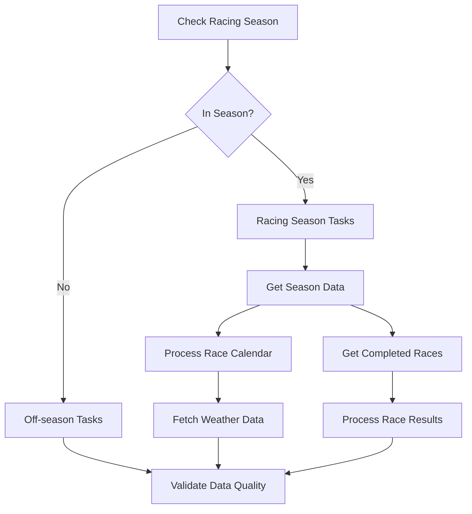
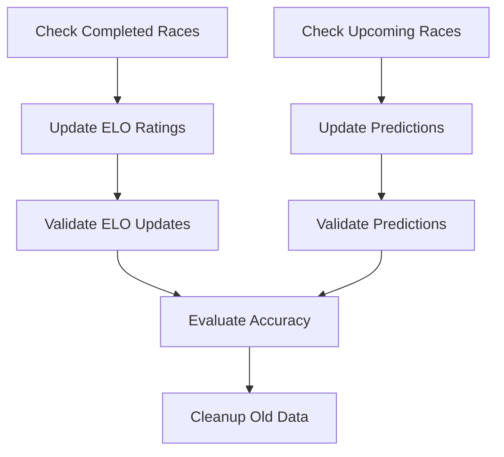

# F1 Analytics Airflow DAGs

This document describes the Airflow DAGs used for orchestrating F1 data ingestion and processing workflows in the F1 Analytics platform.

## Overview

The F1 Analytics platform uses Apache Airflow to orchestrate complex data workflows including:

- Daily ingestion of F1 data from external APIs (Ergast API, Weather APIs)
- Processing of race results, driver standings, and constructor data
- ELO rating calculations for drivers and teams
- ML model prediction updates
- Data quality validation and monitoring

## DAG Structure

### Directory Layout

```
f1-analytics/airflow/
├── dags/                    # Airflow DAG definitions
│   ├── f1_daily_ingestion.py      # Main daily data ingestion DAG
│   └── f1_elo_predictions.py      # ELO and prediction update DAG
├── plugins/                 # Custom Airflow operators and utilities
│   └── f1_operators.py            # F1-specific custom operators
├── tests/                   # Test suite for DAGs and operators
│   ├── test_f1_daily_ingestion.py
│   └── test_f1_operators.py
├── requirements.txt         # Python dependencies for Airflow
└── pytest.ini             # Test configuration
```

## DAGs

### 1. F1 Daily Data Ingestion DAG (`f1_daily_ingestion.py`)

**Schedule:** Daily at 6 AM UTC (configurable via `F1_DATA_INGESTION_SCHEDULE`)

**Purpose:** Orchestrates daily ingestion of F1 data from various sources.

#### Task Groups

##### Racing Season Tasks
Executed during F1 racing season (March - December):

1. **get_season_data**: Fetch current F1 season race calendar from Ergast API
2. **process_race_calendar**: Process and insert/update race data in database
3. **get_completed_races**: Fetch race results for completed races
4. **process_race_results**: Process and store race results, driver results, team results
5. **fetch_weather_data**: Fetch weather information for upcoming races

##### Off-season Tasks
Executed during F1 off-season (January - February):

1. **offseason_maintenance**: Placeholder for maintenance tasks

#### Key Features

- **Conditional Execution**: Automatically detects racing season and executes appropriate tasks
- **Error Handling**: Comprehensive retry logic and error handling
- **Data Validation**: Built-in data quality checks and validation
- **API Integration**: Robust integration with Ergast F1 API
- **Weather Data**: Integration with weather APIs for race predictions

#### Configuration

Environment variables for configuration:

```bash
# DAG Schedule
F1_DATA_INGESTION_SCHEDULE="0 6 * * *"  # Daily at 6 AM UTC

# API Configuration
F1_ERGAST_BASE_URL="https://ergast.com/api/f1"
F1_WEATHER_API_KEY="your-weather-api-key"

# Database Configuration
F1_DB_HOST="postgres-service"
F1_DB_PORT="5432"
F1_DB_NAME="f1_analytics"

# DAG Behavior
F1_DAG_DEFAULT_RETRIES="3"
F1_DAG_RETRY_DELAY="5"
F1_DAG_EMAIL_ON_FAILURE="admin@f1analytics.com"
```

### 2. ELO and Predictions DAG (`f1_elo_predictions.py`)

**Schedule:** Every 6 hours (configurable via `ELO_UPDATE_SCHEDULE`)

**Purpose:** Updates ELO ratings and ML predictions for drivers and teams.

#### Task Groups

##### ELO Processing
1. **update_elo_ratings**: Calculate and update ELO ratings based on race results
2. **validate_elo_updates**: Validate ELO rating consistency

##### Prediction Processing
1. **update_predictions**: Generate/update ML model predictions for upcoming races
2. **validate_predictions**: Validate prediction data quality

#### Additional Tasks

1. **check_completed_races**: Identify races needing ELO updates
2. **check_upcoming_races**: Identify races needing prediction updates
3. **evaluate_prediction_accuracy**: Calculate accuracy metrics for completed races
4. **cleanup_old_predictions**: Remove old prediction data

#### Configuration

```bash
# Schedules
ELO_UPDATE_SCHEDULE="0 */6 * * *"        # Every 6 hours
PREDICTION_REFRESH_SCHEDULE="0 */2 * * *"  # Every 2 hours

# ELO Configuration
F1_ELO_K_FACTOR="32"
F1_ELO_BASE_RATING="1500"

# Model Configuration
F1_MODEL_VERSION="v1"
F1_MODEL_API_ENDPOINT="http://ml-service:8080/api/v1/predictions"
```

## Custom Operators

### 1. EloRatingOperator

Calculates and updates ELO ratings for drivers and teams based on race results.

**Key Features:**
- Pairwise comparison algorithm for ELO calculation
- Configurable K-factor for rating sensitivity
- Support for both single race and batch processing
- Minimum ELO floor to prevent extreme ratings

**Usage:**
```python
update_elo = EloRatingOperator(
    task_id="update_elo_ratings",
    postgres_conn_id="f1_analytics_postgres",
    process_all_recent=True,
    k_factor=32
)
```

### 2. F1APIDataOperator

Fetches data from external F1 APIs with robust error handling and retry logic.

**Key Features:**
- Automatic retry mechanism with exponential backoff
- Configurable timeouts and retry attempts
- Support for multiple API endpoints and parameters
- JSON and text response handling

**Usage:**
```python
fetch_data = F1APIDataOperator(
    task_id="fetch_season_data",
    api_endpoint="current.json",
    season="2024",
    timeout=30,
    retry_attempts=3
)
```

### 3. DataValidationOperator

Performs comprehensive data quality validation with customizable rules.

**Key Features:**
- Table existence and row count validation
- Custom SQL-based validation rules
- Configurable failure thresholds
- Duplicate detection and data consistency checks

**Usage:**
```python
validate_data = DataValidationOperator(
    task_id="validate_race_data",
    postgres_conn_id="f1_analytics_postgres",
    table_name="races",
    validation_rules={
        "future_races": {
            "query": "SELECT COUNT(*) FROM races WHERE race_date < CURRENT_DATE AND status = 'scheduled'",
            "fail_threshold": 0
        }
    }
)
```

### 4. PredictionModelOperator

Generates and updates ML model predictions for race outcomes.

**Key Features:**
- Integration with ML model services
- Batch processing for multiple races
- ELO-based prediction generation (simplified implementation)
- Prediction versioning and tracking

**Usage:**
```python
update_predictions = PredictionModelOperator(
    task_id="update_race_predictions",
    postgres_conn_id="f1_analytics_postgres",
    model_version="v1",
    update_all_upcoming=True
)
```

## Data Flow

### Daily Ingestion Flow



### ELO and Prediction Flow



## Monitoring and Alerting

### Key Metrics

1. **Data Freshness**: Time since last successful data update
2. **Data Quality**: Validation rule pass/fail rates
3. **API Performance**: Response times and error rates from external APIs
4. **ELO Consistency**: Validation of ELO rating ranges and changes
5. **Prediction Accuracy**: Model performance metrics

### Alerting Configuration

The DAGs support email alerting for failures:

```python
default_args = {
    "email_on_failure": True,
    "email": ["admin@f1analytics.com", "data-team@f1analytics.com"],
    "retries": 3,
    "retry_delay": timedelta(minutes=5)
}
```

### Logging

All tasks use structured logging with configurable levels:

```python
import logging
logger = logging.getLogger(__name__)
logger.info("Processing race calendar", extra={"season": 2024, "races": 23})
```

## Testing

### Running Tests

```bash
# Navigate to airflow directory
cd f1-analytics/airflow/

# Install test dependencies
pip install -r requirements.txt

# Run all tests
pytest tests/

# Run specific test file
pytest tests/test_f1_daily_ingestion.py -v

# Run with coverage
pytest tests/ --cov=dags --cov=plugins --cov-report=html
```

### Test Categories

1. **Unit Tests**: Test individual functions and operators
2. **Integration Tests**: Test database interactions and API calls
3. **DAG Validation Tests**: Validate DAG structure and dependencies
4. **Mock Tests**: Test with mocked external dependencies

### Example Test

```python
def test_elo_calculation():
    """Test ELO rating calculation logic."""
    operator = EloRatingOperator(task_id="test", dag=None)

    results = [
        (1, 1, 1, 1500, 1500),  # driver_id, team_id, position, elo
        (2, 1, 2, 1500, 1500),
        (3, 2, 3, 1500, 1400)
    ]

    elo_updates = operator._calculate_elo_updates(results)

    # Winner should gain ELO points
    assert elo_updates[0][2] > 1500
```

## Deployment

### Kubernetes Deployment

The Airflow DAGs are deployed using the existing Kubernetes infrastructure:

```yaml
# From infrastructure/kubernetes/airflow-deployment.yaml
spec:
  volumes:
  - name: dags-volume
    persistentVolumeClaim:
      claimName: airflow-dags-pvc
```

### DAG Deployment Process

1. **Development**: Write and test DAGs locally
2. **Testing**: Run comprehensive test suite
3. **Staging**: Deploy to staging environment for integration testing
4. **Production**: Deploy to production with monitoring

### Environment Variables

Production deployment requires these environment variables:

```bash
# Database
F1_DB_HOST=postgres-service
F1_DB_PASSWORD_FILE=/run/secrets/db-password

# APIs
F1_WEATHER_API_KEY_FILE=/run/secrets/weather-api-key

# Airflow
AIRFLOW_FERNET_KEY_FILE=/run/secrets/airflow-fernet-key
```

## Troubleshooting

### Common Issues

#### 1. API Rate Limiting
**Symptom**: HTTP 429 errors from Ergast API
**Solution**: Implement exponential backoff, use caching

#### 2. Database Connection Issues
**Symptom**: PostgreSQL connection timeouts
**Solution**: Check connection pool settings, verify credentials

#### 3. ELO Calculation Errors
**Symptom**: Extreme ELO ratings or calculation failures
**Solution**: Validate input data, check race results completeness

#### 4. Memory Issues
**Symptom**: Worker OOM errors during large data processing
**Solution**: Increase worker memory limits, implement data chunking

### Debug Mode

Enable debug logging for troubleshooting:

```bash
export F1_LOG_LEVEL=DEBUG
export F1_DB_ECHO_SQL=true
```

### Performance Optimization

1. **Database Indexing**: Ensure proper indexes on frequently queried columns
2. **Connection Pooling**: Configure appropriate database connection pool sizes
3. **Parallel Processing**: Use task groups for independent parallel execution
4. **Data Chunking**: Process large datasets in chunks to manage memory

## Security Considerations

### Secrets Management

- All sensitive credentials stored in Kubernetes secrets
- No hardcoded API keys or passwords in DAG code
- Database connections use environment variables or secret files

### Access Control

- Airflow RBAC configured for role-based access
- DAG-level permissions for different user groups
- Audit logging for all DAG executions and modifications

### Data Privacy

- PII data handling according to data protection regulations
- Secure API communication using HTTPS
- Regular security audits of DAG code and configurations

## Future Enhancements

### Planned Features

1. **Real-time Streaming**: Integration with Kafka for real-time race data
2. **Advanced ML Models**: Integration with MLflow for model versioning
3. **Multi-source APIs**: Additional data sources beyond Ergast API
4. **Automated Testing**: CI/CD integration with automated DAG testing
5. **Performance Monitoring**: Advanced metrics and performance dashboards

### Scalability Improvements

1. **Horizontal Scaling**: Support for multiple Airflow workers
2. **Data Partitioning**: Partition large tables by season/year
3. **Caching Layer**: Redis caching for frequently accessed data
4. **Async Processing**: Asynchronous task execution for improved performance