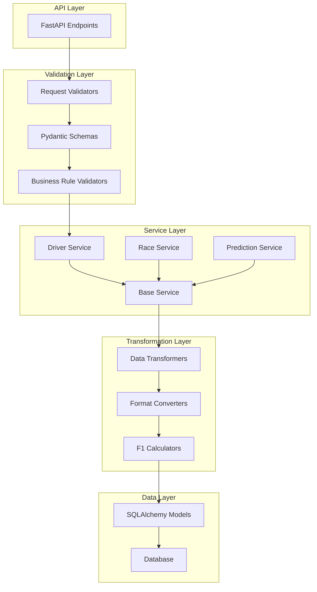

# Data Transformation & Validation Layer

## Overview

The F1 Analytics platform features a comprehensive data transformation and validation layer that ensures data quality, consistency, and proper format conversion across the entire application. This layer consists of multiple components working together to provide robust data handling capabilities.

## Architecture



## Components

### 1. Pydantic Schemas

Comprehensive request/response validation using Pydantic with F1-specific business rules.

#### Base Schemas

```python
from app.schemas.base import BaseSchema, TimestampMixin, PaginationParams

class BaseSchema(BaseModel):
    """Base schema with common configuration."""

    model_config = ConfigDict(
        from_attributes=True,
        use_enum_values=True,
        validate_assignment=True,
        json_encoders={
            datetime: lambda dt: dt.isoformat() + 'Z',
            Decimal: lambda d: float(d) if d is not None else None,
        }
    )
```

#### Domain-Specific Schemas

**Driver Schemas:**
- `DriverCreate`: Creation validation with driver code format checking
- `DriverUpdate`: Update validation with selective field updates
- `DriverResponse`: API response with calculated fields and relationships
- `DriverRanking`: Rankings with ELO ratings and championship positions
- `DriverStatistics`: Performance metrics and career statistics

**Race Schemas:**
- `RaceCreate`: Race creation with season consistency validation
- `RaceResponse`: Complete race information with circuit and weather data
- `RaceWeekendSummary`: Comprehensive weekend data with results and predictions
- `RaceCalendarResponse`: Season calendar with progress tracking

**Prediction Schemas:**
- `PredictionCreate`: ML prediction validation with probability constraints
- `RacePredictionsSummary`: Complete race predictions with statistics
- `ModelPerformanceMetrics`: ML model accuracy and reliability metrics
- `BatchPredictionRequest`: Bulk prediction processing validation

### 2. Service Layer

Advanced service classes that handle complex business operations with automatic validation.

#### Base Service

```python
from app.services.base import BaseService

class BaseService(Generic[ModelType, CreateSchemaType, UpdateSchemaType, ResponseSchemaType]):
    """Base service providing CRUD operations with data transformation."""

    def create(self, db: Session, obj_in: CreateSchemaType, **kwargs) -> ResponseSchemaType:
        """Create with validation and transformation."""

    def update(self, db: Session, db_obj: ModelType, obj_in: UpdateSchemaType, **kwargs) -> ResponseSchemaType:
        """Update with validation and transformation."""

    def list(self, db: Session, skip: int = 0, limit: int = 100, filters: Optional[Dict] = None) -> List[ResponseSchemaType]:
        """List with pagination and filtering."""
```

#### Specialized Services

**DriverService:**
- Driver CRUD operations with ELO rating validation
- Statistics calculation and ranking management
- Team consistency validation
- Performance analytics

**RaceService:**
- Race management with season validation
- Results processing and validation
- Weather data integration
- Calendar and scheduling operations

**PredictionService:**
- ML prediction management with probability validation
- Batch prediction processing
- Accuracy tracking and model performance metrics
- Prediction aggregation and analysis

### 3. Validation Utilities

Sophisticated validation patterns with decorators and business rule validators.

#### Validation Decorators

```python
from app.utils.validators import validate_request_data, validate_database_constraints

@validate_request_data(DriverCreate)
@validate_database_constraints(
    unique_fields=["driver_code"],
    foreign_keys={"current_team_id": Team}
)
@validate_business_rules(
    validate_driver_team_consistency,
    validate_elo_rating_bounds
)
@handle_service_errors
def create_driver_endpoint(db: Session, data: dict):
    return driver_service.create_driver(db, data)
```

#### F1-Specific Validators

**F1DataValidator Class:**
- Race season consistency validation
- Driver-team relationship checks
- Prediction probability aggregation validation
- Race result data consistency
- Qualifying session progression logic
- ELO rating bounds with warnings for extreme values
- Lap time format validation and normalization

**Business Rule Validators:**
- `validate_race_not_completed`: Prevents modifications to completed races
- `validate_race_is_completed`: Ensures race completion for accuracy calculations
- `validate_future_race_date`: Validates race dates for new races
- `validate_driver_team_consistency`: Checks driver-team relationships
- `validate_prediction_probabilities`: Validates total race probabilities

### 4. Data Transformation

Comprehensive data transformation with F1-specific calculations.

#### F1DataTransformer

```python
from app.utils.transformers import F1DataTransformer, TransformationConfig

config = TransformationConfig(
    include_metadata=True,
    include_relationships=True,
    include_calculated_fields=True,
    datetime_format="iso",
    decimal_places=2
)

transformer = F1DataTransformer(config)
```

**Transformation Methods:**
- `transform_driver_for_api`: Enriches driver data with age, experience level, ELO category
- `transform_race_for_api`: Adds race status, days until race, season progress
- `transform_prediction_summary`: Calculates entropy, competitiveness score, probability distribution
- `transform_race_result_with_context`: Adds position change analysis, performance rating
- `enrich_prediction_with_context`: Adds confidence levels, market comparisons
- `create_season_summary`: Comprehensive season statistics and standings

#### Data Calculations

**Performance Metrics:**
- ELO rating categorization (elite, top_tier, competitive, developing, rookie)
- Experience level calculation based on career data
- Competitiveness score based on prediction spread
- Performance rating for race results
- Points efficiency calculations

**F1-Specific Calculations:**
- Lap time format conversion and parsing
- Points calculation based on finishing position
- Position change categorization
- Race completion rates
- Prediction entropy and uncertainty measures

### 5. Error Handling

Sophisticated error handling with detailed context information.

#### Exception Types

```python
from app.services.base import DataTransformationError, ValidationError

class ValidationError(DataTransformationError):
    """Exception for validation errors with field context."""

    def __init__(self, message: str, field: Optional[str] = None, value: Any = None):
        self.message = message
        self.field = field
        self.value = value
```

#### Error Response Format

```json
{
    "error": "Validation Error",
    "message": "Driver code must be exactly 3 letters",
    "field": "driver_code",
    "value": "INVALID",
    "timestamp": "2024-01-15T10:30:00Z"
}
```

## Usage Examples

### Complete Driver Workflow

```python
from app.services import driver_service
from app.schemas import DriverCreate, DriverUpdate
from app.utils.validators import handle_service_errors

# Create driver with validation
@handle_service_errors
def create_driver(db: Session, driver_data: dict):
    # Automatic validation and transformation
    validated_data = DriverCreate(**driver_data)

    # Service handles business logic and constraints
    driver = driver_service.create_driver(db, validated_data)

    # Response includes calculated fields
    return driver  # DriverResponse with age, elo_category, etc.

# Get driver statistics
stats = driver_service.get_driver_statistics(db, driver_id=1, season=2024)
# Returns: total_races, wins, podiums, points, win_rate, etc.

# Update ELO rating with validation
updated_driver = driver_service.update_elo_rating(db, driver_id=1, new_rating=2150)
```

### Race Prediction Workflow

```python
from app.services import prediction_service, race_service
from app.schemas import PredictionCreate, BatchPredictionRequest

# Create individual prediction
prediction_data = PredictionCreate(
    race_id=1,
    driver_id=1,
    predicted_win_probability=25.5,
    model_version="v1.2.3"
)

prediction = prediction_service.create_prediction(db, prediction_data)

# Batch prediction processing
batch_request = BatchPredictionRequest(
    race_ids=[1, 2, 3],
    model_version="v1.2.3",
    include_confidence=True
)

batch_result = prediction_service.batch_create_predictions(db, batch_request)

# Get race predictions with analysis
race_predictions = prediction_service.get_race_predictions(db, race_id=1)
# Returns: RacePredictionsSummary with statistics, favorite, competitiveness_score
```

### Data Transformation Examples

```python
from app.utils.transformers import F1DataTransformer

transformer = F1DataTransformer()

# Transform driver with enrichment
driver_data = transformer.transform_driver_for_api(
    driver,
    include_stats=True,
    season=2024
)
# Result includes: age, experience_level, elo_category

# Transform predictions with analysis
prediction_summary = transformer.transform_prediction_summary(predictions, race)
# Result includes: entropy, competitiveness_score, probability_distribution

# Create season summary
season_summary = transformer.create_season_summary(races, results, predictions, 2024)
# Result includes: championship standings, prediction accuracy, season progress
```

## Testing

### Test Coverage

The validation layer includes comprehensive test coverage across all components:

```bash
# Run all validation tests
pytest tests/test_validation_layer.py -v

# Run with coverage report
pytest tests/test_validation_layer.py --cov=app.schemas --cov=app.services --cov=app.utils --cov-report=html
```

### Test Categories

1. **Pydantic Schema Tests:**
   - Valid data validation
   - Invalid data rejection
   - Edge case handling
   - Field validation rules

2. **Data Validator Tests:**
   - Range validation (ELO, probabilities)
   - Format validation (lap times, driver codes)
   - Business rule validation
   - Error message accuracy

3. **Service Layer Tests:**
   - CRUD operations with validation
   - Business logic validation
   - Error handling and rollback
   - Integration with database constraints

4. **Transformation Tests:**
   - Data format conversion
   - Calculation accuracy
   - Enrichment logic
   - Performance metrics

5. **Integration Tests:**
   - End-to-end workflows
   - Error propagation
   - Performance under load
   - Data consistency

## Performance Considerations

### Optimization Strategies

1. **Lazy Loading:** Relationships loaded only when needed
2. **Batch Operations:** Bulk validation for large datasets
3. **Caching:** Validation results cached for repeated operations
4. **Efficient Queries:** Optimized database queries with proper indexing
5. **Pagination:** Built-in pagination support for large result sets

### Performance Monitoring

```python
from app.utils.transformers import F1DataTransformer

# Configure for performance
config = TransformationConfig(
    include_metadata=False,        # Reduce response size
    include_relationships=False,   # Avoid N+1 queries
    include_calculated_fields=True # Keep business logic
)

transformer = F1DataTransformer(config)
```

## Best Practices

### Schema Design

1. **Use Specific Validation:** Implement F1-specific validation rules
2. **Provide Clear Error Messages:** Include field context and expected values
3. **Validate Early:** Catch errors at the request level
4. **Use Enums:** Leverage enum validation for status fields
5. **Document Constraints:** Clear documentation of validation rules

### Service Layer

1. **Single Responsibility:** Each service handles one domain
2. **Transaction Management:** Proper rollback on validation failures
3. **Error Propagation:** Consistent error handling across services
4. **Business Logic Separation:** Keep validation separate from database operations
5. **Testing:** Comprehensive unit and integration tests

### Transformation

1. **Configuration-Driven:** Use configuration to control transformation behavior
2. **Performance Aware:** Optimize for common use cases
3. **Consistent Formatting:** Standard formats across all transformations
4. **Caching Strategy:** Cache expensive calculations
5. **Error Handling:** Graceful degradation for transformation failures

## Future Enhancements

### Planned Features

1. **Advanced Caching:** Redis-based validation result caching
2. **Async Validation:** Asynchronous validation for large datasets
3. **ML Integration:** Machine learning-based data quality scoring
4. **Real-time Validation:** WebSocket-based real-time data validation
5. **Performance Analytics:** Detailed performance monitoring and optimization
6. **Custom Validators:** Plugin system for custom validation rules
7. **Data Lineage:** Track data transformations for audit trails