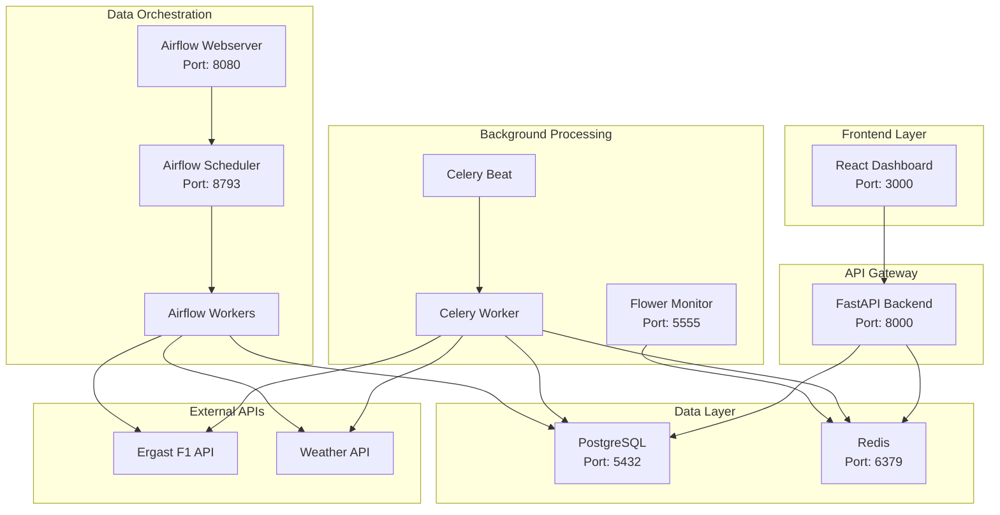

# 🏎️ F1 Prediction Analytics Platform

A comprehensive Formula One prediction analytics platform with Docker containerization for seamless development and deployment, combined with advanced ML-powered race predictions and database infrastructure.

## 🚀 Quick Start

### Prerequisites

- Docker (>= 20.10)
- Docker Compose (>= 2.0)
- Git
- 8GB+ RAM recommended

### One-Command Setup

```bash
./scripts/init_dev.sh
```

This will:
- Build all Docker containers
- Start the complete development environment
- Initialize the database with sample data
- Verify all services are running

### Access Points

Once setup is complete, access the application at:

- **Frontend Dashboard**: http://localhost:3000
- **Backend API**: http://localhost:8000
- **API Documentation**: http://localhost:8000/docs
- **Task Monitor (Flower)**: http://localhost:5555
- **Airflow Webserver**: http://localhost:8080
- **Database**: localhost:5432
- **Redis**: localhost:6379

## 📊 Architecture Overview

### System Architecture



### Database Schema

The system uses PostgreSQL with comprehensive F1 data modeling:

#### Core Entities
- **Teams**: F1 constructors with Elo ratings and performance tracking
- **Drivers**: F1 drivers with team associations and detailed statistics
- **Circuits**: Race tracks with characteristics (length, type, location)
- **Races**: Race events with season/round information and status

#### Results & Performance
- **RaceResults**: Final race positions, points, and performance data (partitioned by race_id)
- **QualifyingResults**: Qualifying session times and grid positions
- **WeatherData**: Race weather conditions affecting performance

#### Predictions & Analysis
- **Predictions**: ML-generated win probabilities by model version (partitioned by race_id)
- **PredictionAccuracy**: Post-race accuracy metrics (Brier score, log loss)
- **Users**: Authentication and role-based access control

### Key Database Features

- **Comprehensive Constraints**: Check constraints for data validation
- **Performance Indexes**: Optimized queries for race data and predictions
- **Materialized Views**: Driver rankings for fast leaderboard queries
- **Table Partitioning**: Ready for partitioning race_results and predictions by race_id
- **Foreign Key Relationships**: Proper referential integrity across entities

## 🔄 Data Orchestration & Workflows

The platform uses Apache Airflow for orchestrating complex data workflows and ensuring reliable data ingestion and processing.

### Airflow DAGs

#### 1. F1 Daily Data Ingestion (`f1_daily_ingestion`)
- **Schedule**: Daily at 6 AM UTC
- **Purpose**: Orchestrates daily F1 data ingestion from external APIs
- **Tasks**:
  - Season data fetching from Ergast API
  - Race calendar processing
  - Race results ingestion
  - Weather data collection
  - Data quality validation

#### 2. ELO and Predictions (`f1_elo_predictions`)
- **Schedule**: Every 6 hours
- **Purpose**: Updates ELO ratings and ML predictions
- **Tasks**:
  - ELO rating calculations for drivers and teams
  - ML model prediction generation
  - Prediction accuracy evaluation
  - Data cleanup and maintenance

### Custom Operators

- **EloRatingOperator**: Handles driver/team ELO rating calculations
- **F1APIDataOperator**: Robust F1 API data fetching with retry logic
- **DataValidationOperator**: Comprehensive data quality validation
- **PredictionModelOperator**: ML model prediction generation and updates

### Workflow Features

- **Conditional Execution**: Season-aware task execution (racing vs off-season)
- **Error Handling**: Comprehensive retry logic and failure alerts
- **Data Quality**: Built-in validation and monitoring
- **Scalability**: Support for parallel task execution and worker scaling

For detailed information about the Airflow setup, see [docs/airflow-dags.md](../docs/airflow-dags.md).

# Application
ENVIRONMENT=development
DEBUG=true
LOG_LEVEL=INFO
```

**Frontend:**
```env
VITE_API_URL=http://localhost:8000
VITE_APP_NAME=F1 Analytics Dashboard
VITE_ENVIRONMENT=development
```

## Setup Instructions

### 1. Install Dependencies

```bash
cd f1-analytics/backend
pip install -r requirements.txt
```

### 2. Database Setup

```bash
# Create PostgreSQL database
createdb f1_analytics

# Run migrations
alembic upgrade head
```

### 3. Verify Installation

```bash
# Run model validation tests
python test_models.py

# Check migration status
alembic current
```

## Model Usage Examples

### Creating Data

```python
from app.models import Team, Driver, Circuit, Race
from app.database import SessionLocal

db = SessionLocal()

# Create team
team = Team(team_name="Red Bull Racing", nationality="Austria")
db.add(team)

# Create driver
driver = Driver(
    driver_code="VER",
    driver_name="Max Verstappen",
    nationality="Netherlands",
    date_of_birth=date(1997, 9, 30),
    current_team=team
)
db.add(driver)

db.commit()
```

### Querying Data

```python
# Get driver with team
driver = db.query(Driver).filter(Driver.driver_code == "VER").first()
print(f"{driver.driver_name} drives for {driver.current_team.team_name}")

# Get race results with relationships
results = (db.query(RaceResult)
          .join(Race)
          .join(Driver)
          .filter(Race.season_year == 2024)
          .order_by(Race.race_date)
          .all())
```

### Model Properties

```python
# Driver properties
print(f"Age: {driver.age}")
print(f"Current team: {driver.current_team.team_name}")

# Race status checks
print(f"Completed: {race.is_completed}")
print(f"Future race: {race.is_future_race}")

# Weather analysis
print(f"Hot weather: {weather.is_hot_weather}")
print(f"Impact score: {weather.weather_impact_score}/10")

# Prediction confidence
print(f"Confidence: {prediction.confidence_category}")
print(f"Is favorite: {prediction.is_favorite}")
```

## Performance Features

### Indexes
- Composite indexes on common query patterns
- BRIN indexes for time-series data (predictions)
- Covering indexes for leaderboard queries

### Materialized Views
- `driver_rankings`: Pre-computed driver statistics
- Refreshed daily via scheduled jobs

### Constraints
- Check constraints for data validation
- Unique constraints for business rules
- Foreign key constraints for referential integrity

## Migration Management

### Create New Migration
```bash
alembic revision --autogenerate -m "Description"
```

### Apply Migrations
```bash
alembic upgrade head
```

### Rollback Migration
```bash
alembic downgrade -1
```

## 🚀 Production Deployment

### 🔒 Production Security Checklist

**⚠️ CRITICAL**: Read `PRODUCTION_SECURITY.md` before production deployment!

```bash
# 1. Generate secure credentials
./scripts/generate_secrets.sh

# 2. Create production environment
cp .env.production.template .env.production
# Edit with your secure values

# 3. Validate security configuration
python -c "from app.core.config import get_settings, validate_production_config; s = get_settings(); print(validate_production_config(s))"

# 4. Deploy with production compose
docker-compose -f infrastructure/docker-compose.prod.yml up -d
```

### Production Environment Variables

**🔐 Security Requirements:**
- JWT secret minimum 64 characters (use `openssl rand -base64 64`)
- Database passwords minimum 16 characters
- No localhost/development URLs in production
- HTTPS-only CORS origins
- Debug mode disabled (`DEBUG=false`)

```env
# Database (SECURE PASSWORDS REQUIRED)
POSTGRES_DB=f1_analytics_prod
POSTGRES_USER=f1user_prod
POSTGRES_PASSWORD=GENERATE_SECURE_PASSWORD_MIN_16_CHARS

# Redis (SECURE PASSWORDS REQUIRED)
REDIS_PASSWORD=GENERATE_SECURE_REDIS_PASSWORD_MIN_16_CHARS

# JWT (GENERATE WITH: openssl rand -base64 64)
JWT_SECRET_KEY=CRYPTOGRAPHICALLY_SECURE_64_CHARACTER_MINIMUM

# Security Configuration
CORS_ORIGINS=https://yourdomain.com,https://www.yourdomain.com
ALLOWED_HOSTS=yourdomain.com,www.yourdomain.com
ENVIRONMENT=production
DEBUG=false

# Rate Limiting
RATE_LIMIT_PER_MINUTE=30
RATE_LIMIT_BURST=60

# External APIs
WEATHER_API_KEY=your-production-weather-api-key

# Monitoring
GRAFANA_ADMIN_PASSWORD=SECURE_GRAFANA_PASSWORD
ENABLE_METRICS=true

# Connection Pool
DATABASE_POOL_SIZE=10
DATABASE_MAX_OVERFLOW=20
DATABASE_POOL_TIMEOUT=30
DATABASE_POOL_RECYCLE=3600
```

## Dependencies

- **SQLAlchemy 2.0+**: ORM and database toolkit
- **Alembic**: Database migration management
- **psycopg2**: PostgreSQL database adapter
- **FastAPI**: Modern Python web framework for API endpoints
- **Pydantic**: Data validation and serialization
- **Redis**: Caching and session management
- **Security**: JWT authentication, bcrypt password hashing
- **Testing**: Comprehensive test suite with >80% coverage requirement

## Contributing

This is a comprehensive F1 prediction analytics system combining advanced database modeling with Docker containerization and enterprise security practices. Future development will focus on ML pipeline enhancements and advanced analytics features.
